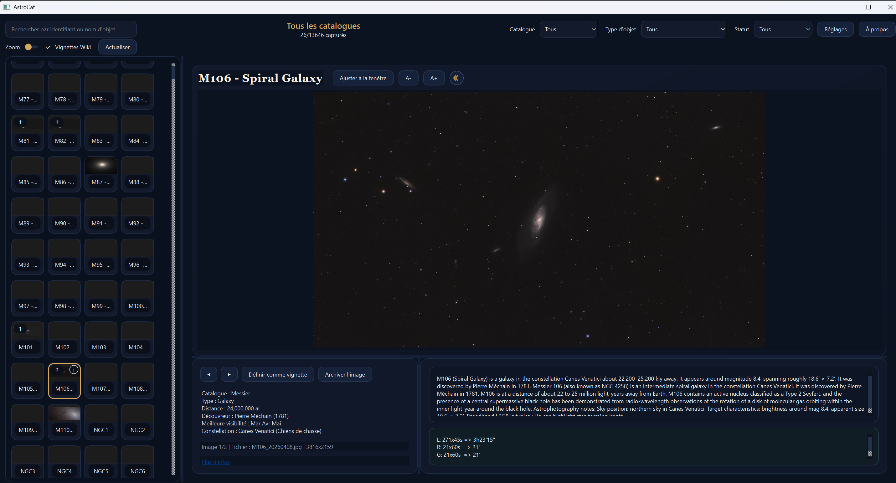
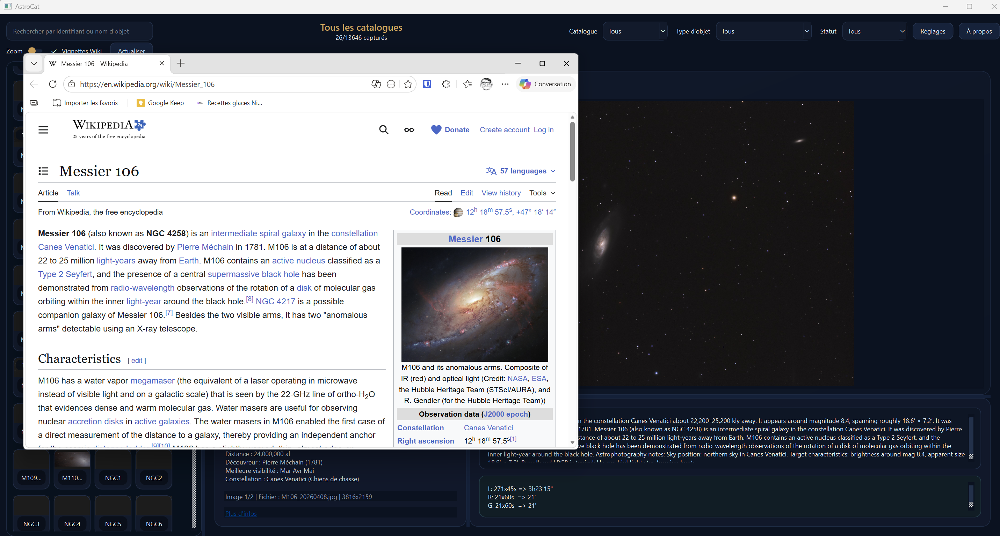
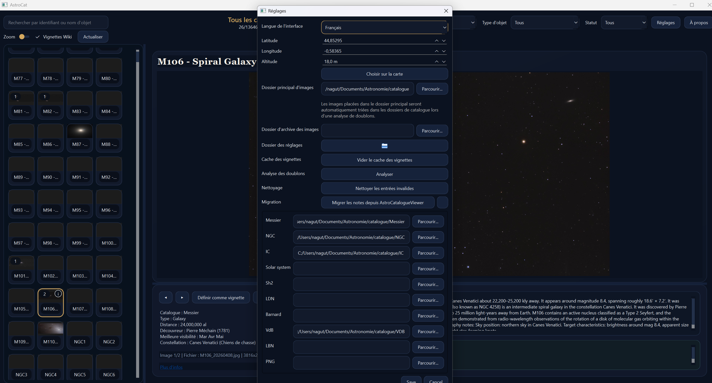
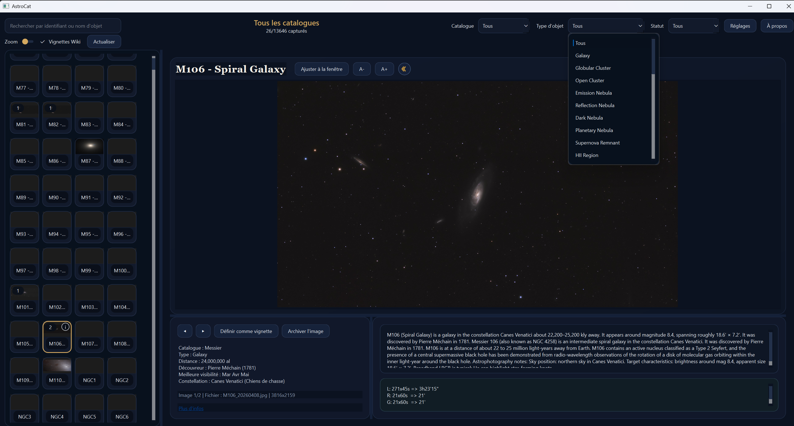

# AstroCat

AstroCat is a desktop app for organizing and browsing deep-sky catalog images (Messier, NGC, Caldwell, Solar system, and more). It provides a fast image grid, filters, rich object metadata, and notes to help plan captures and track progress.

This project is an independent fork of AstroCatalogueViewer.

> **AI assistance disclaimer:** New features in this fork (including notes migration, notes storage refactor, and selected UI updates) were implemented with AI coding assistance.

Copyright and attribution details: [COPYRIGHT](COPYRIGHT).


Status: beta

Latest release: `1.4.0-beta`

Release history: [CHANGELOG.md](CHANGELOG.md)

## Highlights (from original AstroCatalogueViewer)
- Fast grid with zoom, search, and filters (catalog, object type, status)
- Two-column detail view with zoom/pan, notes, and external info links
- Archive action to move selected images into an archive folder
- Wikipedia thumbnails for missing images (toggleable, cached)
- Wikipedia previews labeled as not captured
- Full-screen lightbox on double-click (Exit/Esc/Return)
- Catalog-aware image matching by filename (e.g., M31, NGC7000, C14)
- Messier ↔ NGC alias matching (M31/NGC224) so images appear in both catalogs
- Master image folder support (if all images live in one place)
- Optional catalog-specific image folders
- Offline-safe location picker (browser-based map)

## What AstroCat adds
- New catalogs (including LBN, Sh2, VdB, and others)
- Notes storage refactor with image notes in `photo_notes.json`
- Thumnails storage refactor in `photo_notes.json`
- Built-in migration path from AstroCatalogueViewer notes
- i18n for catalogs (translations in de,es,fr,it in progress)
- new UI


## Quick start (dev)
```bash
python3 -m venv .venv
source .venv/bin/activate
python3 -m pip install -r requirements.txt
python3 app/main.py
```

## Screenshots







## Requirements
- macOS, Windows, and Linux
- Python 3.13+ (or any Python 3.10+ that supports PySide6)
- PySide6 (`pip install -r requirements.txt`)

## Roadmap
See `ROADMAP.md`.

## macOS Build
Clone this repo on macOS and run:

```bash
python3 -m venv .venv
source .venv/bin/activate
python3 -m pip install -r requirements.txt
./scripts/build_macos.sh
```

The packaged app will be in `dist/`. GitHub releases include separate macOS builds:
- Apple Silicon: `AstroCat-macOS-AppleSilicon.zip`
- Intel: `AstroCat-macOS-Intel.zip`

## Windows Build
Clone this repo on Windows and run one of the build scripts (requires Python 3.10+):

PowerShell:
```powershell
python -m venv .venv
.\.venv\Scripts\Activate.ps1
python -m pip install -r requirements.txt
.\scripts\build_windows.ps1
```

CMD:
```bat
python -m venv .venv
.\.venv\Scripts\activate.bat
python -m pip install -r requirements.txt
.\scripts\build_windows.bat
```

The packaged app will be in `dist/`.

## Linux Build
Clone this repo on Linux and run:

```bash
python3 -m venv .venv
source .venv/bin/activate
python3 -m pip install -r requirements.txt
./scripts/build_linux.sh
```

The packaged app will be in `dist/`.

## Migration from AstroCatalogueViewer
AstroCat can migrate notes from a previous AstroCatalogueViewer installation from the Settings screen.

Compatibility note:
- Migration behavior has been tested against AstroCatalogueViewer `v3.0-beta`
- Compatibility with earlier, different, or future AstroCatalogueViewer versions is not guaranteed
- If upstream changes the notes structure, migration may require updates in AstroCat

What is migrated:
- Object notes from `*_catalog.json`
- Image notes to `photo_notes.json` (AstroCat format)

Behavior:
- Existing destination notes are preserved
- Already existing notes are counted as ignored
- A migration log is generated for troubleshooting

## Configuration
Open **Settings** to set:
- **Master Image Folder** (optional): a single folder containing all your images
- **Per-catalog Image Folder**: use if you store catalogs separately
- **Archive Image Folder**: where archived images are moved
- **Observer Location**: used for best-visibility suggestions

The “best visibility” months are computed from RA/Dec + your latitude/longitude using a sidereal-time approximation. It’s a solid planning heuristic (altitude at midnight on the 15th of each month) and will drive the “Suggested” filter accurately.

The **Wiki thumbnails** toggle lives in the main toolbar. When enabled, missing images use cached Wikipedia thumbnails and are labeled as not captured.

### Image Naming
Filenames must include the standard object ID, for example:
- `M31_Andromeda_Galaxy.jpg`
- `NGC7000 North America Nebula.tif`
- `IC5070_Pelican.png`
- `C14 Double Cluster.jpg`

The app matches IDs anywhere in the filename.

## Metadata
Metadata is stored in JSON files under `data/`. Example files included:
- `data/object_catalog.json` (Messier)
- `data/ngc_catalog.json` (sample)
- `data/ic_catalog.json` (sample)
- `data/caldwell_catalog.json` (sample)

Notes you add in the app are saved in the photo_notes.json in the setting folder (new).

Messier metadata is complete and includes expanded descriptions with astrophotography guidance. The NGC, IC, and Caldwell metadata sets are in progress.

### Localization
AstroCat UI localization uses JSON resources stored in `app/locales/<lang>.json`.

Configuration keys:
- `ui_locale`: interface language (`system`, `en`, `fr`, ...)

### Resetting saved settings
If the app has a bad image path or filter state saved, delete the config file:
- macOS: `~/Library/Application Support/AstroCat/config.json`
- Windows: `%APPDATA%\AstroCat\config.json`
- Linux: `~/.config/AstroCat/config.json`

## Known limitations
- Status is beta: behavior and file formats may still evolve
- Metadata coverage is still in progress for some catalogs
- Support is best effort via GitHub issues

## Credits
- Original project: AstroCatalogueViewer by Paul Spinelli
- AstroCat fork and maintenance: Nicolas Aguttes
- Additional catalogs and contributions: denis2704

## Support
Feedback, suggestions, and bug reports are welcome via GitHub issues, but I do not guarantee I will be very reactive

## License
See `LICENSE`.
See [COPYRIGHT](COPYRIGHT).

